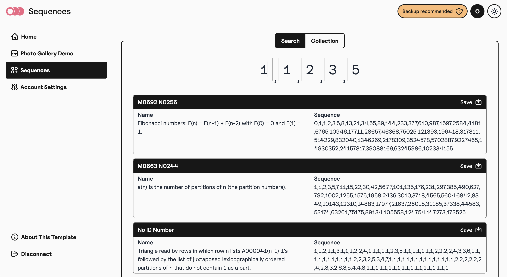
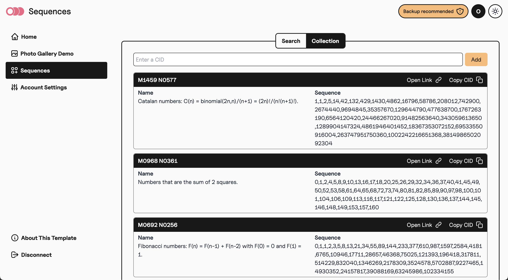

# Fission HackFS 2023 Workshop

[](https://fission.codes) [](https://github.com/oddsdk/ts-odd) [](https://discord.gg/zAQBDEq) [](https://talk.fission.codes)

Welcome to the workshop! 👋

We'll be creating a sequence explorer to search and collect sequences from the [On-line Encyclopedia of Integer Sequences (OEIS)](https://oeis.org/).

The completed workshop will include search and collection views:




## Preparation

Please ensure you have installed `git` and `node` installed on your machine:

- Install git: https://git-scm.com/book/en/v2/Getting-Started-Installing-Git
- Install node: https://nodejs.org/en/download

If you already have `node` on your machine, check that you have `v18.0.0` or newer.

## Running the app

Clone the HackFS 2023 Workshop repository:

```sh
git clone https://github.com/oddsdk/hackfs-workshop-2023.git
```

Install the project dependencies:

```sh
cd hackfs-workshop-2023
npm install
```

Run the app:

```sh
npm run dev
```

Open a web browser and navigate to [localhost:5173](http://localhost:5173), and you should see the app running.

## Workshop exercises

Now that the app is running, we can start writing some code. 🙌

The starter code implements an OEIS search and displays matching sequences. Using the ODD SDK, we'll save sequences to the Webnative File System (WNFS). We'll also view the saved sequences on IPFS and explore content identifiers (CIDs).

All of the exercises are in two files:

- Search component: https://github.com/oddsdk/hackfs-workshop-2023/blob/main/src/routes/sequences/components/Search.svelte
- Collection component: https://github.com/oddsdk/hackfs-workshop-2023/blob/main/src/routes/sequences/components/Collection.svelte

These files are Svelte components, but you will only need to write JavaScript to complete the exercises. Each time you save a file, the web app should update without running another command.

Connect as a new user in the app and navigate to the `Sequences` page from the sidebar.

Open the Search and Collection components in your code editor:

- Search component: `src/routes/sequences/components/Search.svelte`
- Collection component: `src/routes/sequences/components/Collection.svelte`

Start with the Search component, then move on to the Collection component.

Each file has exercises marked with `TODO` and comments describing the exercise. A few additional exercises are marked `OPTIONAL ADVANCED EXERCISE`. Save these for last.